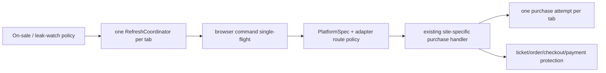

# HunterX v0.4.9 architecture and security audit

Baseline: remote `main` commit `982d766561aa7f37d2f7810a928b69d9f164d568`.
The baseline suite produced 710 passes and one stale version-expectation failure;
branch-aware coverage was 31.282%. The newly added `attempt_lifecycle.py` was
unused, duplicated `TixCraftPurchaseAttempt`, and called a nonexistent dataclass
`_replace`; it was removed instead of creating a competing state machine.

## Ownership decisions

- `TixCraftPurchaseAttempt` remains authoritative; completion keys include its
  identity and are cleared at attempt boundaries.
- `RefreshCoordinator` owns monotonic dispatch/minimum-interval/one-shot state.
  ReloadGuard and trigger/leak components still provide policy/evidence. A
  broader deletion of all legacy flags was deferred because those flags also
  encode site-specific DOM generation and navigation confirmation; behavior and
  consistency tests cover the boundary instead of a risky big-bang rewrite.
- `PlatformSpec` owns platform identity. Runtime capabilities and validation
  strength use distinct names. Site handlers were not moved into a new registry
  because doing so offers no live-flow benefit in this release and increases
  dispatch regression risk.
- The existing `PerformanceTrace` records the added route/area/candidate/ticket/
  CAPTCHA stages; coordinator traces already record refresh lateness and remain
  bounded.

## Security and supply chain

- Local mutating/sensitive control APIs require a per-launch random secret,
  constant-time comparison and HttpOnly SameSite cookie. Loopback and
  same-origin checks remain.
- API masking, URL credential removal and log redaction remain. Runtime log
  writes measured approximately 0.82 ms each on the validation host; hot-path
  calls are rate-limited and state/log sizes are bounded, so a second async log
  queue was not introduced.
- A safe all-profile/backup DPAPI migration could not be proven together with
  non-Windows source compatibility in this change. Persisted secret-at-rest
  encryption is therefore an explicit blocker, not replaced with weak custom
  crypto. Users must protect settings/profile/backup files.
- Windows runtime dependencies are transitively resolved with SHA-256 hashes.
  GitHub Actions use immutable commits. Medium/high Bandit, pip-audit, CodeQL
  and dependency review remain enabled.

No bypass, automated payment or live purchase was introduced or tested.
